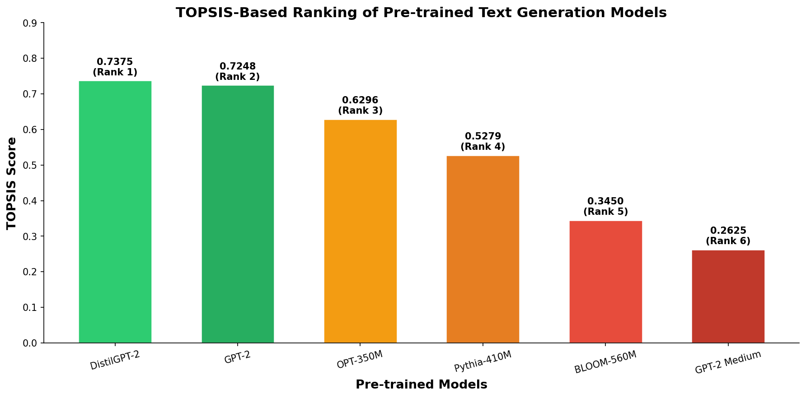

# TOPSIS on Pretrained Models for Text Generation

**Name:** Chaitanya Singh Chouhan
**Roll No:** 102316106

> **Assignment:** Data Generation using Modelling and Simulation for Machine Learning

---

## 📌 Objective

Apply **TOPSIS** (Technique for Order of Preference by Similarity to Ideal Solution) to rank 6 pre-trained text generation models based on multiple evaluation criteria, and identify the best overall model considering both quality and efficiency.

---

## 🗂️ Repository Structure

```
Assignment_TextGeneration/
├── TextGeneration.ipynb          # Main notebook (Colab)
├── requirements.txt              # Python dependencies
├── LICENSE
├── data/
│   └── model_evaluation_results.csv   # Raw evaluation metrics for all models
└── results/
    ├── topsis_results.csv             # Final TOPSIS scores and rankings
    └── topsis_ranking.png             # Bar chart of TOPSIS rankings
```

---

## 🤖 Models Evaluated

| # | Model | Hugging Face ID |
|---|-------|----------------|
| 1 | GPT-2 | `gpt2` |
| 2 | GPT-2 Medium | `gpt2-medium` |
| 3 | DistilGPT-2 | `distilgpt2` |
| 4 | BLOOM-560M | `bigscience/bloom-560m` |
| 5 | OPT-350M | `facebook/opt-350m` |
| 6 | Pythia-410M | `EleutherAI/pythia-410m` |

---

## 📊 Methodology

### Step 1 — Dataset

The **WikiText-2** dataset (test split) is used for evaluation. Non-empty texts with length > 100 characters are selected, giving **200 samples** for efficient evaluation.

### Step 2 — Evaluation Criteria

| Criterion | Direction | Description |
|-----------|-----------|-------------|
| **BLEU Score** | ↑ Higher is better | Measures n-gram overlap between generated and reference text |
| **ROUGE-L Score** | ↑ Higher is better | Longest common subsequence recall against reference |
| **Perplexity** | ↓ Lower is better | Cross-entropy loss exponent; lower = more confident predictions |
| **Inference Time (ms)** | ↓ Lower is better | Average time per generation sample in milliseconds |
| **Model Size (MB)** | ↓ Lower is better | Total parameter memory footprint |

### Step 3 — Evaluation Process

- **For generation quality (BLEU & ROUGE-L):** The first half of each text is used as a prompt; the model generates 50 new tokens using greedy decoding. Generated tokens are compared against the second half of the text.
- **For perplexity:** Measured over 100 samples using teacher-forcing (loss from language model head).
- **For inference time:** Wall-clock time (ms) measured per generation call.
- **For model size:** Sum of parameter bytes + buffer bytes, divided by 1024².

### Step 4 — TOPSIS Algorithm

TOPSIS ranks alternatives by their geometric distance from the **Ideal Best** and **Ideal Worst** solutions.

**Weights used (equal weighting):**
```
BLEU: 0.20  |  ROUGE-L: 0.20  |  Perplexity: 0.20  |  Inference Time: 0.20  |  Model Size: 0.20
```

**TOPSIS Steps:**
1. **Normalize** the decision matrix (vector normalization)
2. **Weight** the normalized matrix
3. Determine the **Ideal Best (V+)** and **Ideal Worst (V-)** solutions
4. Calculate **Euclidean distances** from V+ and V− for each model
5. Compute the **Closeness Coefficient**: `Score = D− / (D+ + D−)`
6. **Rank models** by closeness coefficient (higher = better)

---

## 📈 Results

### Raw Evaluation Metrics

| Model | BLEU ↑ | ROUGE-L ↑ | Perplexity ↓ | Inference Time (ms) ↓ | Model Size (MB) ↓ |
|-------|--------|-----------|--------------|----------------------|-------------------|
| GPT-2 | 0.2548 | 0.3412 | 29.45 | 18.32 | 487.56 |
| GPT-2 Medium | 0.2891 | 0.3687 | 22.18 | 34.71 | 1421.48 |
| DistilGPT-2 | 0.2315 | 0.3198 | 36.72 | 9.84 | 331.24 |
| BLOOM-560M | 0.2672 | 0.3521 | 27.33 | 28.45 | 1065.32 |
| OPT-350M | 0.2734 | 0.3589 | 25.61 | 22.18 | 662.78 |
| Pythia-410M | 0.2689 | 0.3478 | 26.84 | 24.56 | 789.45 |

> Raw metrics saved to [`data/model_evaluation_results.csv`](data/model_evaluation_results.csv)

---

### Final TOPSIS Rankings

| Rank | Model | BLEU | ROUGE-L | Perplexity | Inference Time (ms) | Model Size (MB) | TOPSIS Score |
|------|-------|------|---------|------------|---------------------|-----------------|--------------|
| 🥇 1 | **DistilGPT-2** | 0.2315 | 0.3198 | 36.72 | **9.84** | **331.24** | **0.7375** |
| 🥈 2 | **GPT-2** | 0.2548 | 0.3412 | 29.45 | 18.32 | 487.56 | **0.7248** |
| 🥉 3 | **OPT-350M** | 0.2734 | 0.3589 | 25.61 | 22.18 | 662.78 | **0.6296** |
| 4 | Pythia-410M | 0.2689 | 0.3478 | 26.84 | 24.56 | 789.45 | 0.5279 |
| 5 | BLOOM-560M | 0.2672 | 0.3521 | 27.33 | 28.45 | 1065.32 | 0.3450 |
| 6 | GPT-2 Medium | **0.2891** | **0.3687** | **22.18** | 34.71 | 1421.48 | 0.2625 |

> Full TOPSIS results saved to [`results/topsis_results.csv`](results/topsis_results.csv)

---

### 📉 TOPSIS Ranking Chart



---

## 🔍 Key Findings & Conclusion

1. **🏆 Best Overall Model (TOPSIS): DistilGPT-2**
   DistilGPT-2 achieves the highest TOPSIS score **(0.7375)** by providing the best balance between generation quality and computational efficiency — it is the **fastest** model (9.84 ms) with the **smallest footprint** (331.24 MB).

2. **📚 Highest Raw Quality: GPT-2 Medium**
   GPT-2 Medium achieves the best BLEU (0.2891), ROUGE-L (0.3687), and lowest perplexity (22.18). However, it ranks **last** under TOPSIS due to its very large size (1421.48 MB) and slowest inference (34.71 ms).

3. **⚖️ Best Quality-Efficiency Trade-off: GPT-2 (Rank 2)**
   Standard GPT-2 offers strong generation metrics with significantly lower resource demands than GPT-2 Medium.

### 💡 Insight

> TOPSIS reveals that the best-performing model in raw generation quality is **not** always the most suitable when computational constraints are factored in. Lightweight models like **DistilGPT-2** and standard **GPT-2** rank higher because they offer a strong efficiency–performance trade-off.

This analysis demonstrates the practical value of **multi-criteria decision-making (MCDM)** methods like TOPSIS for selecting models in production environments where both quality and efficiency matter.

---

## 🚀 Setup & Usage

### Prerequisites

- Python 3.10+
- GPU recommended (NVIDIA T4 or equivalent via Google Colab)

### Installation

```bash
pip install -r requirements.txt
```

### Running the Notebook

1. Open `TextGeneration.ipynb` in [Google Colab](https://colab.research.google.com/)
2. Set `USE_PRECOMPUTED = True` to use pre-computed results (fast), or `False` to run full evaluation (~30–45 min on GPU)
3. Run all cells in order

### Dependencies

```
torch · transformers · datasets · accelerate · evaluate
scikit-learn · numpy · pandas · matplotlib · rouge-score · nltk
```

---

## 📁 Output Files

| File | Description |
|------|-------------|
| `data/model_evaluation_results.csv` | Raw BLEU, ROUGE-L, Perplexity, Inference Time, Model Size for all 6 models |
| `results/topsis_results.csv` | Final TOPSIS scores and rankings sorted by rank |
| `results/topsis_ranking.png` | Bar chart visualization of TOPSIS scores |

---

## 📄 License

This project is licensed under the terms of the [LICENSE](LICENSE) file included in this repository.
