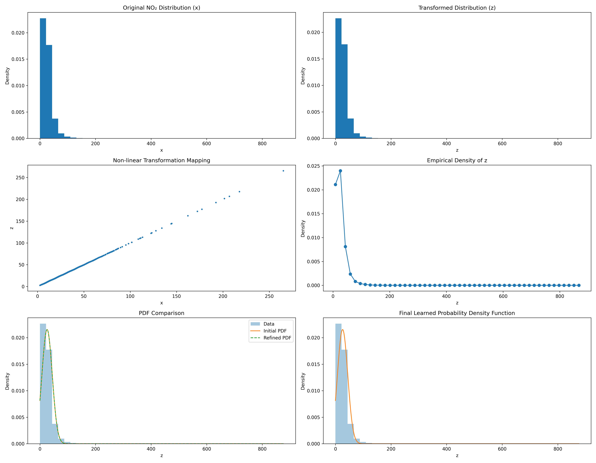

# NO2 Data Analysis and Transformation Project

## Introduction
This project analyzes Nitrogen Dioxide (NO2) levels from the provided dataset `data.csv`. The primary objective is to apply a specific non-linear transformation to the NO2 data, analyze the changes in distribution, and model the probability density function (PDF) of the transformed data.

## Methodology

### 1. Data Processing
The analysis begins by loading environmental data and isolating the NO2 concentration column. Useable data is prepared by removing missing or null entries to ensure statistical validity.

### 2. Parameter Derivation
Key transformation parameters are derived uniquely from the identifier **102316106**:
*   **$r$**: 102316106
*   **$a_r$**: 0.20 (Calculated via modulo arithmetic)
*   **$b_r$**: 0.6 (Calculated via arithmetic operations on the ID digits)

### 3. Non-Linear Transformation
We apply a sinusoidal transformation to the original NO2 values ($x$) to generate a new dataset ($z$).
The transformation equation is:
$$ z = x + 0.20 \sin(0.6 x) $$

### 4. Statistical Modeling
The transformed data ($z$) is modeled using a Gaussian-like Probability Density Function (PDF) of the form $f(z) = c e^{-\lambda(z-\mu)^2}$. Initial estimates for the parameters $\lambda$, $\mu$, and $c$ are calculated based on the mean and variance of the transformed data.

## Visualizations

The analysis employs several visualization techniques to understand the data:

1.  **Histogram Comparison**: Side-by-side histograms display the density distribution of the original NO2 values versus the transformed values ($z$), highlighting the shift and shape change caused by the transformation.
2.  **Transformation Mapping**: A scatter plot visualizes the relationship between the original ($x$) and transformed ($z$) values, demonstrating the non-linear, sinusoidal nature of the mapping function.
3.  **Empirical Probability Density**: A point plot representing the empirical PDF of the transformed data, used to verify the distribution shape before fitting the analytical model.

### Final Visualization result
The following image represents the key visualizations generated during the analysis:

## Results: Parameter Estimates
Based on the statistical analysis of the transformed data, the initial parameter estimates for the PDF model are:
*   **$\lambda$ (Lambda)**: ~0.00146
*   **$\mu$ (Mu)**: ~25.81
*   **$c$ (Normalization Constant)**: ~0.0216
